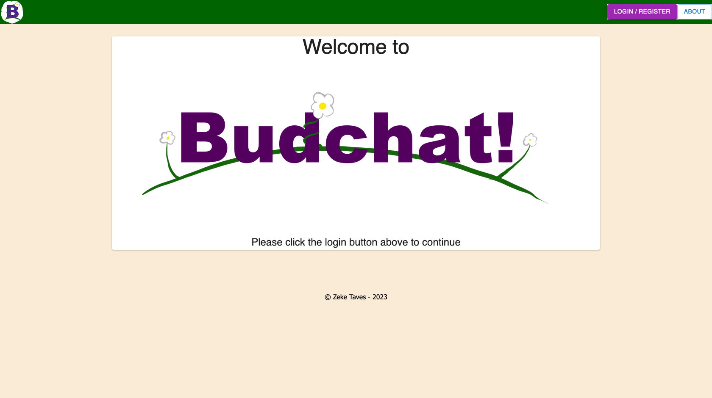
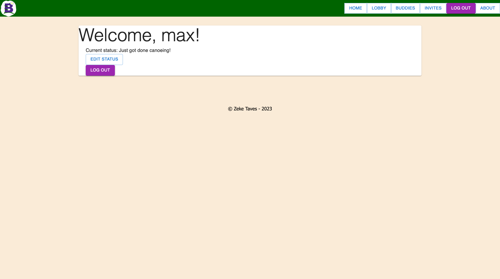
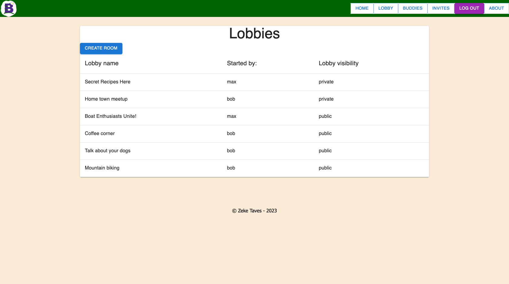
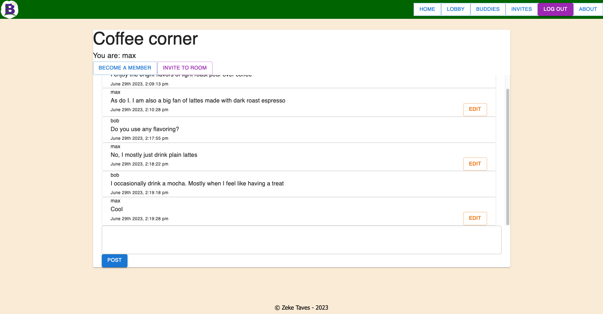

# Budchat
This is a light weight, easy to set up, minimalist chatroom app that will allow for simple communication between users over a network. It allows users to make accounts, create chat rooms, join chat rooms, type posts, and add other users as 'buddies'. This app has been built for compatibility with desktop, and mobile.

This project was made for a two week solo project assignment at the Emerging Digital Academy in Fargo, ND.

Hope you enjoy!

## Screenshots

## Server instructions
* Install node.js
* install npm
* install PostgreSQL
* Download repo
* Create new database called chatroom_solo_project, this can easily be done by copy pasting the queries in `database.sql` into whatever program is being used to interact with PostgreSQL
* run `npm install` in terminal to install all dependencies
* It is recommended to have a `.env` with `SERVER_SESSION_SECRET=*enter_secret_here*` to be enable more secure encryption of passwords, and cookie data
* run `npm run server` in terminal to start server
* run `npm run client` in terminal to start a react server
* You may want to have an admin for the app. To create an admin account, make a new account using the client, then in PostgreSQL enter the query `UPDATE "user" SET privilege = 1 WHERE id = 1;` assuming that the first account made is the one that you want to be admin
* The app should be set and good to go

# Server API
Most routes in this app are expecting a logged in user with a session cookie

## User routes

### GET /api/user/
* Protected
Sends back the logged in user's user object from the session

### GET /api/user/:id
* Protected

Sends information about a single user back to the client, including buddy status

### PUT /api/user/status
* Protected
* REQUIRES `{ "status": "string" }`

### POST /api/user/register
* REQUIRES `{ "username": "string", "password": "string" }`

Creates a new user profile

### POST /api/user/login
* REQUIRES `{ "username": "string", "password": "string" } `

Logs in user

### POST /api/user/logout

Logs out user

## Room routes

### GET /api/rooms
* Protected

Returns a list of rooms the user is allowed to join

### GET /api/rooms/membership/:id
* Protected

Returns whether the user is member of a selected room

### GET /api/rooms/details/:id
* Protected

Returns the name of the room, and the creator's name

### GET /api/rooms/invite
* Protected

Get a list of all room invites for user

### POST /api/rooms
* Protected
* REQUIRES `{ "room_name": "string", "type": "string" }`
* Do note that `"type"` is expected to be either `"public"` or `"private"`

Creates a new chat room

### POST /api/rooms/membership
* Protected
* REQUIRES `{ "room_id": number }`

Makes user a new member of room, this may be changed later because it is not very secure

### POST /api/rooms/invite
* Protected
* REQUIRES `{ "invitee_id": number, "room_id": number }`

Sends a new invite to invitee user

### DELETE /api/rooms/:id
* Protected

Deletes chat room if user is the creator, or admin

### DELETE /api/rooms/membership/:id
* Protected

Deletes user's room membership from the database

### DELETE /api/rooms/invite/:id
* Protected

Deletes a room invite sent to user

## Buddy routes

### GET /api/buddy
* Protected

Returns a list of all the user's buddies

### GET /api/buddy/invites
* Protected

Returns a list of buddy invites to user

### GET /api/buddy/invitee/:id
* Protected

Gets a list of buddys that can be invited to the room_id that aren't already members

### POST /api/buddy
* Protected
* REQUIRES `{ "user_id_2": number }`

Sends a buddy request to a user

### DELETE /api/buddy/:id
* Protected

Deletes a buddy row using the buddy id NOT user id

### PUT /api/buddy/invite/:id
* Protected

Accepts a buddy request that has been sent

# Technology used
* node.js
* express
* react
* PostgreSQL
* redux
* redux-saga
* socket.io
* Axios
* react-router
* Material-ui
* Sweet Alert 2
* Moment.js